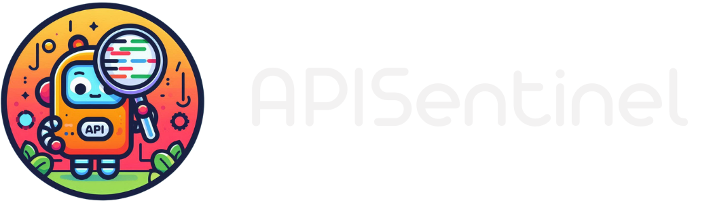

APISentinel Dashboard is a web-based interface designed to visualize and analyze API test results generated by [APISentinel](https://github.com/ASauvage/APISentinel). It provides an intuitive dashboard to inspect test sessions, view detailed request and response logs, and track errors. With several filtering features, APISentinel Dashboard allows users to analyze test results side by side, making it easier to identify inconsistencies.

## Features

- **Visualize API Test Results**: Display structured test reports with clear insights.
- **Detailed Request & Response Logs**: Inspect API requests, responses, and headers.
- **Error Tracking**: Highlight failed tests and API inconsistencies.
- **Filtering & Comparison**: Compare multiple test sessions to identify changes over time.
- **User-Friendly Dashboard**: Simple and intuitive web interface.

> [!NOTE] 
> Test results will be filtered according to the versions supported.

| Dashboard          | APISentinel        |
| ------------------ | ------------------ |
| v1.0.0 - v1.0.3    | v1.6.0 - v1.6.1    |

## Requirements

- Node.js (v14+ recommended)
- MongoDB (for storing test results)

## Installation

### Manual Installation

Download the latest release and install dependencies:
   ```sh
   npm install --omit=dev
   ```

Configure the environment variables:
   - Copy `.env.example` to `.env`
   - Set up your MongoDB connection string and other configurations

Start the server:
   ```sh
   npm start
   ```
The dashboard will be available at http://localhost:3000.

### Docker Installation

Pull the pre-built Docker image from GitHub Container Registry:
```sh
docker pull ghcr.io/asauvage/apisentinel_dashboard:latest
```

```sh
docker run -d -p 3000:3000 --name apisentinel_dashboard ghcr.io/asauvage/apisentinel_dashboard:latest -e DB_HOST='mongodb://<hostname>:<port>/<database>'
```

The dashboard will be available at http://localhost:3000 (or the configured port).

## Usage

1. Run API tests using [APISentinel](https://github.com/ASauvage/APISentinel).
2. Open APISentinel Dashboard in your browser.
3. Browse test sessions, inspect results, and compare data.
